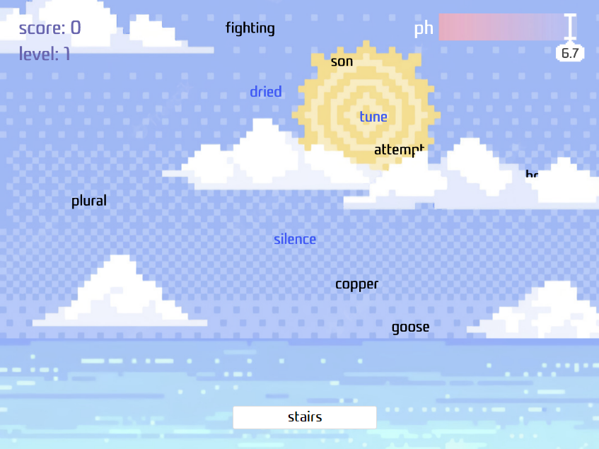
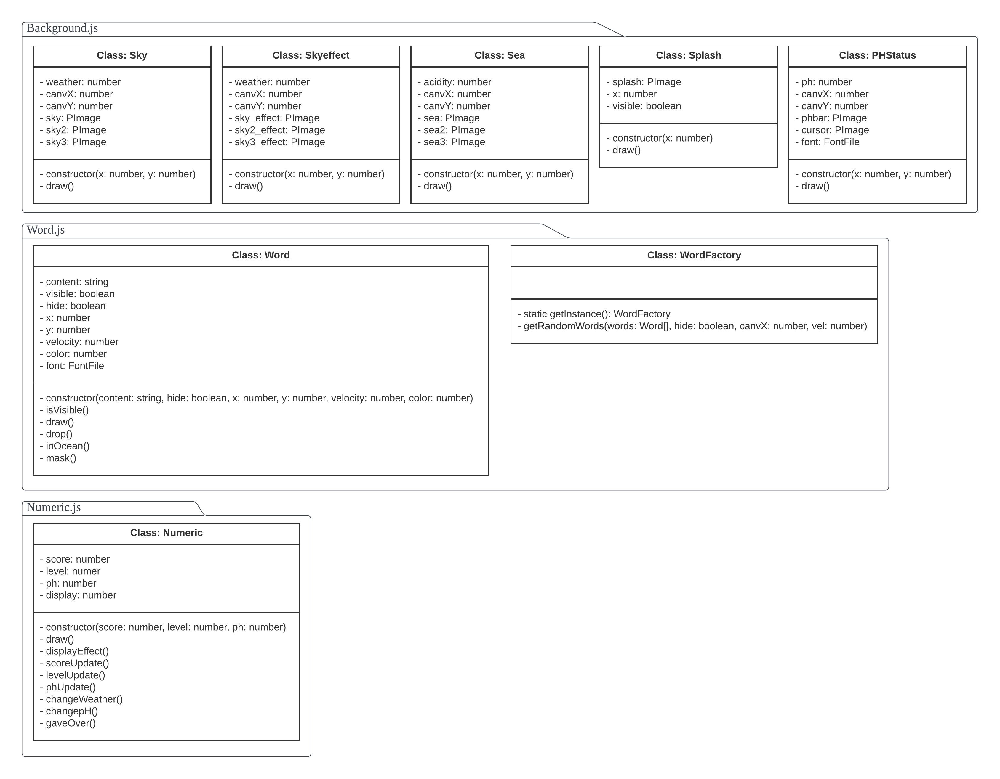

# ID311 Project 1: Typing Practice Game 'Acid Rain'

### Basic Inforation & Links
- ID: 20200633
- Name: Haeseul Cha
- Email: jjchs1@kaist.ac.kr
- [Git Repository](https://github.com/Cathy-CHS/TypingPractice_AcidRain.git)
- [Video Demo](URL)

### Content
  - [Ideation: What is 'Acid Rain'?](#ideation:-what-is-acid-rain)
  - [Mechanism](#mechanism)
  - [Code Organization](#code-organization)
  - [Technical Issues](#technical-issues)
  - [References & Resources](#references-&-resources)

## Ideation: What is 'Acid Rain'?
**Acid Rain** is one of the typing practice games included in 'Hancom Typing Practice 2007', which is developed by HANCOM Inc. The game helps users improve typing skills, with *removing acid word raindrops and saving the ocean!* This [game playing video](https://youtu.be/AVlQQAfFlKo) may help you understand much better about the game.

## Mechanism

According to the playing window shown in the image, the overall mechanism of *Acid Rain* is as follows.
1. **How Does This Game Work?**
   - *Acid raindrops*, which are randomly created words, fall from the sky. When the word reaches to the sea surface, it disappears and make the ocean *acid*.
   - The *pH level* of the ocean decreases as more and more words are dissolved in it. It drops by 0.3 per word, starting from 7.0. When it becomes 1.0, the game ends.
   - The words can be disappeared when users *type* and submit them in the downside text input box.
   - When certain numbers of words are dropped, the level of the game is incremented and the falling speed increases. The faster the speed, the more words the users will miss.
   - Some of the words have *special effects* for a short period when the user destroy it. They are blue-colored to be distinguished with normal words. When the effects are enabled, the name of effects are displayed at the upperleft side of the screen, where the level and score are located.
     - Increase/decrease the falling speed
     - Hide words by masking with *?* (If the user types any correct word, then this effect vanishes.)
     - Reset the pH value of the ocean to start value (=7.0)
2. **What Should Users Do?**: Users have to destroy the word raindrops by typing the word correctly, before the ocean becomes *too acid*. When users type words and press enter, the input box becomes empty and the typed word is sent. Users get points for each correct word, and the goal is to get points as much as they can. When the level increases, points per word also gets higher and higher.

## Code Organization
#### Code Architecture
```sh
TypingPractice_AcidRain
├── assets
├── css
│   └── style.css
├── src
│   ├── Background.js
│   ├── Constants.js
│   ├── main.js
│   ├── Numeric.js
│   └── Word.js
└── index.html
```
#### UML Diagram

- **`Background.js`**: Draw backgrounds and handle interactions with it
  - `Sky` Class: 
- **`Word.js`**
  - Periodically update the location(`location_x` and `location_y`) of words(drop the word rain)
  - Destroy the word when user input is correct or `location_y` gets equal to the ocean surface height
  - Effect handler: depends on the value `effect`, apply special effects
  - Update the score and pH value
  - Convert level and increase speed
  - Game start&end
- **`Numeric.js`**
  - drop rate
  - distance per one drop
  - `effect`: indicator for applying effect function
  - ocean surface height
- **`Constant.js`**
    - resource for random word generation
- **`Main.js`**
  - pH status bar
  - user text input
  - level&score: display int value
  - window shoing special effects

## Technical Issues
- **Expected Features Taught in Class**
  - Objects&OOP
  - DOM Structures
  - Functional programming(maybe to update variables using ma)
- **Background**: ocean image whose color depends by the pH value
- **UI Design**: Placement of objects, text font/size/color, etc

## References & Resources
- **References**
    - [p5.js reference](https://p5js.org/ko/reference/)
    - [npm package to import random English words](https://www.npmjs.com/package/random-words)
    - [Removing an item from array](https://stackoverflow.com/questions/5767325/how-can-i-remove-a-specific-item-from-an-array-in-javascript)
    - [Rounding float values](https://blog.edit.kr/entry/%EC%86%8C%EC%88%98%EC%A0%90-2%EC%9E%90%EB%A6%AC-%EC%9E%90%EB%A5%B4%EA%B8%B0-float-2-decimal)
    - [Generating random values with controlling probability](https://stackoverflow.com/questions/8877249/generate-random-integers-with-probabilities)
    - [Applying fonts on CSS](https://velog.io/@jehjong/CSS%EC%97%90-%ED%8F%B0%ED%8A%B8-%EC%A0%81%EC%9A%A9%ED%95%98%EA%B8%B0-%EC%9B%B9%ED%8F%B0%ED%8A%B8-%ED%8F%B0%ED%8A%B8-%ED%8C%8C%EC%9D%BC)
- **Assets Resources**
    - [Freepik: Copyright free images](https://kr.freepik.com/)
    - [Uppbeat: Copyright free musics](https://uppbeat.io/)